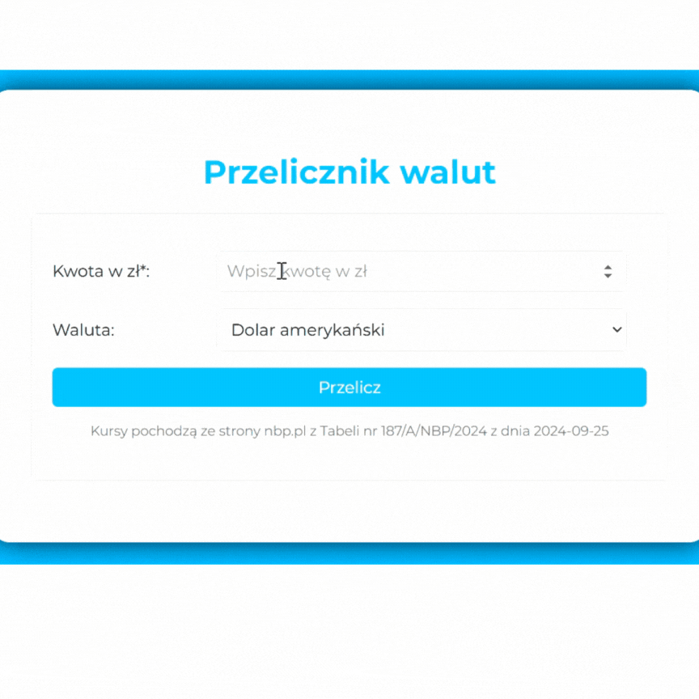

# Currency converter 

## Demo

https://kamila-falgowska.github.io/currency-converter/

## Description

This simple currency converter is designed to help you convert amounts from three different currencies to Polish złoty (PLN). 
You can convert Polish Zloty to:

- Euro (EUR)
- Dollar (USD)
- Pound sterling (GBP)

## Technology used

- HTML
- CSS
- Java Script
- BEM convention
- Normalize CSS
- GIT
